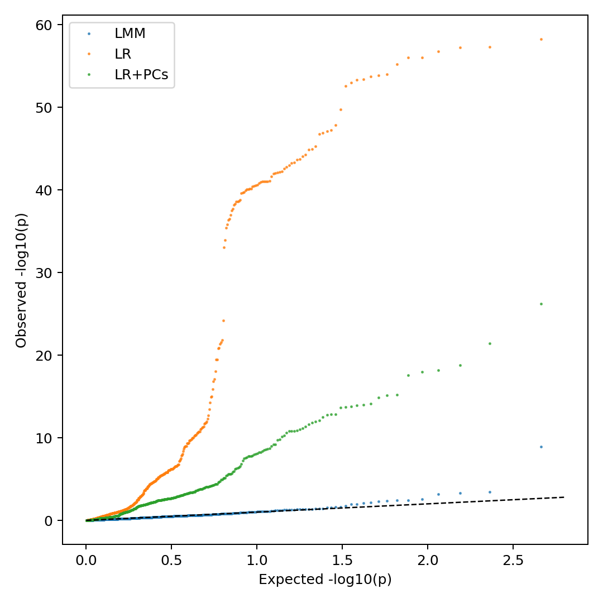
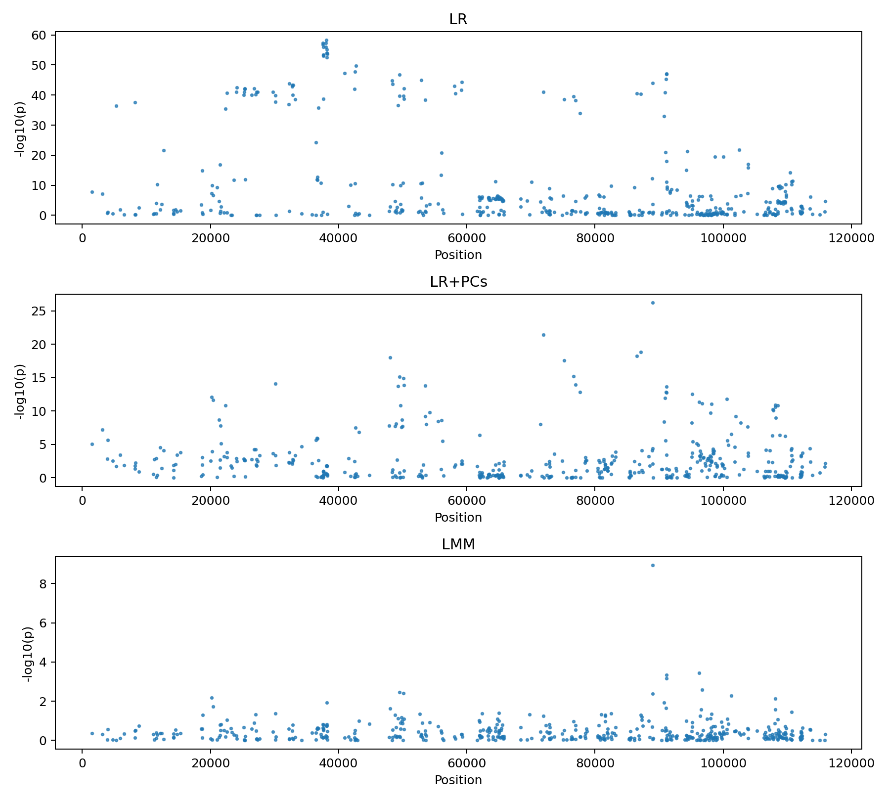
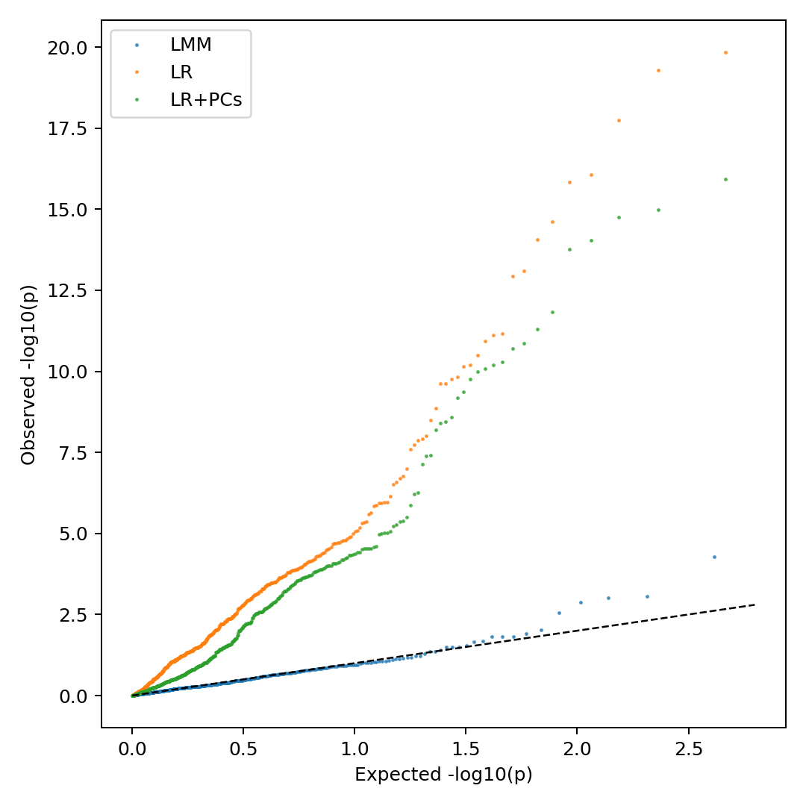
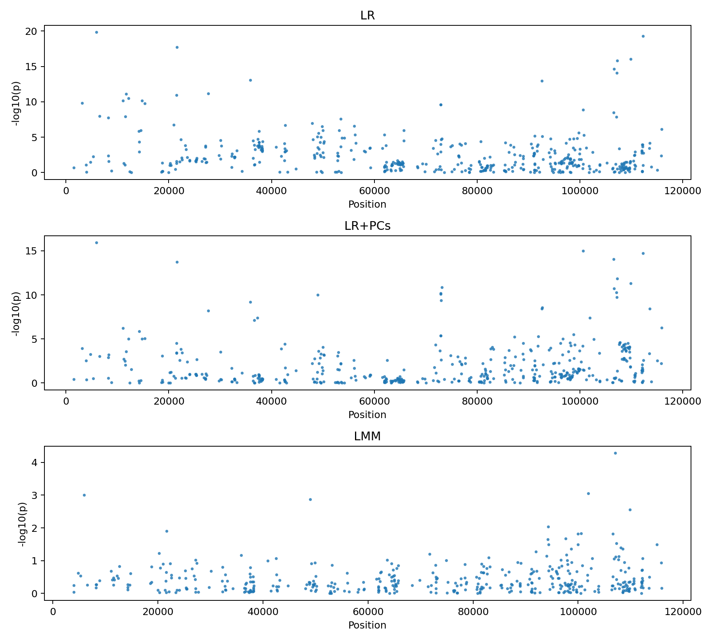

# Benchmarking GWAS Models on *Arabidopsis thaliana* Chromosome 4

## Group Members
Junxi Feng, He Gao, Ningxin Kang

## 1. Introduction
Our project asks a focused methods question: how much does population-structure correction change GWAS behavior on a structured *Arabidopsis thaliana* panel? We benchmarked three approaches on the same chromosome 4 genotype set: naive linear regression (LR), linear regression with genotype principal components (LR+PCs), and a kinship-based linear mixed model (LMM).

We evaluated this in two settings. First, a simulated quantitative phenotype where we know the data-generating process. Second, a real flowering-time phenotype (`FT16`) from `data/raw/values.csv`. This combination lets us test both statistical calibration under controlled conditions and practical behavior on a real trait.

## 2. Methods
### 2.1 Data and preprocessing
Genotypes came from the chromosome 4 VCF in `data/raw/1001G.Chr4.vcf`. During development we found malformed VCF rows near the end of the file, so the pipeline sanitizes invalid lines before PLINK import when `bcftools` is unavailable (`scripts/sanitize_vcf.py`).

We then ran PLINK-based filtering with these thresholds:

- `MAF >= 0.05`
- `GENO missingness <= 0.05`
- biallelic variants only (`--max-alleles 2`)

For real-phenotype analysis, `FT16` values were aligned by `accession_id`, duplicates were averaged, and missing phenotypes were handled as expected by each tool (PLINK drops missing phenotypes; GEMMA branch used explicit phenotyped-sample subsetting in teammate runs).

### 2.2 Association models
We compared:

1. `LR` (PLINK2 single-SNP linear regression, no covariates)
2. `LR+PCs` (same regression with top 5 PCs as fixed covariates)
3. `LMM` (GEMMA with centered kinship and LMM test)

### 2.3 Tooling, versions, and non-default parameters
The pipeline is orchestrated with `scripts/run_pipeline.py`. Key software and settings:

- `plink2` (observed in run logs: `v2.0.0-a.7 AVX2, 10 Mar 2026`)
- `gemma` (LMM binary configured in `config/project.env`)
- `gcta64` (used for simulated phenotype generation in teammate benchmark)
- Python scripts (`pandas`, `numpy`, `scipy`, `matplotlib`) for evaluation plots and metrics

Important non-default parameters used in our scripts:

- VCF import:
  - `--double-id`
  - `--chr-set 5 --allow-extra-chr`
  - `--new-id-max-allele-len 40`
  - `--set-all-var-ids @:#:$r:$a`
- QC export:
  - `--max-alleles 2 --maf 0.05 --geno 0.05`
- LR:
  - `--glm hide-covar allow-no-covars`
- PCA for LR+PCs:
  - `--pca 5 --read-freq <prefix>.afreq`
- LMM:
  - GEMMA kinship: `-gk 1`
  - GEMMA association: `-lmm 4`
  - covariate file built from top 5 PCs

### 2.4 Benchmark outputs
We evaluated each run with:

- QQ plots
- Manhattan plots
- genomic inflation factor (`lambda_GC`)
- top-100 SNP overlap across methods

All outputs are generated by `scripts/05_evaluate.py` and stored in `results/plots/`.

## 3. Results
### 3.1 Simulated phenotype benchmark
From `results/plots/benchmark.lambda_gc.tsv`:

- `LR`: `19.2501`
- `LR+PCs`: `11.6591`
- `LMM`: `0.9209`

From `results/plots/benchmark.top_overlap.tsv` (top-100 overlap):

- `LMM` vs `LR`: `30`
- `LMM` vs `LR+PCs`: `49`
- `LR` vs `LR+PCs`: `32`

These results show severe inflation in naive LR, partial improvement with PCs, and near-calibrated behavior in LMM.

*Figure 1. QQ plot for the simulated phenotype benchmark. The LMM trace stays closest to the null expectation line.*

*Figure 2. Manhattan comparison for the simulated phenotype benchmark. Model choice materially changes the apparent peak profile.*

### 3.2 Real FT16 benchmark
From `results/plots/ft16_benchmark.lambda_gc.tsv`:

- `LR`: `10.2228`
- `LR+PCs`: `5.2349`
- `LMM`: `0.9089`

From `results/plots/ft16_benchmark.top_overlap.tsv` (top-100 overlap):

- `LMM` vs `LR`: `26`
- `LMM` vs `LR+PCs`: `36`
- `LR` vs `LR+PCs`: `41`

The FT16 run reproduces the same ordering as the simulation: LR is most inflated, LR+PCs improves but remains inflated, and LMM is best calibrated.

*Figure 3. QQ plot for FT16. Calibration again improves from LR to LR+PCs to LMM.*

*Figure 4. Manhattan comparison for FT16. Top-ranked signals are not stable across models, especially between LR and LMM.*

### 3.3 Cross-setting summary
Across both phenotypes, the pattern is stable:

- `LR` is strongly anti-conservative (`lambda_GC >> 1`)
- `LR+PCs` reduces inflation but remains miscalibrated
- `LMM` is consistently near 1.0 and therefore best calibrated

This is the central benchmark conclusion and is the main empirical takeaway for method selection on this dataset.

## 4. Discussion: Challenges and Future Work
### 4.1 Practical challenges encountered
The main engineering and analysis issues were:

1. Windows shell mismatch (`bash` scripts in `cmd.exe`): fixed with the Python runner.
2. Corrupted/invalid VCF lines: handled with the sanitize fallback before PLINK import.
3. Variant-ID edge cases (long alleles): addressed with `--new-id-max-allele-len 40`.
4. Sample-ID mismatches between subset files and genotype IDs: required strict ID formatting/alignment.
5. Small subsets producing unstable PCA assumptions: addressed with `--read-freq` in PCA branch.

These were not just setup problems; each one could have changed downstream inference if left unresolved.

### 4.2 Interpretation
Why does calibration improve from LR to LR+PCs to LMM? In this panel, many SNPs correlate with ancestry/relatedness structure. If that structure is also correlated with phenotype, naive LR attributes structure-driven differences to SNP effects, creating inflated p-values. PCs remove broad structure axes, so inflation decreases. LMM additionally models pairwise relatedness through the kinship matrix, which controls residual structure that PCs miss, producing better-calibrated statistics.

### 4.3 Future directions
If we continued this project, our highest-impact next steps would be:

1. expand beyond chromosome 4 to increase marker density and stabilize kinship estimation,
2. repeat benchmarking on additional real traits beyond FT16,
3. run multiple simulation replicates and report variance in calibration metrics,
4. add runtime and memory benchmarks as a secondary comparison axis.

## 5. Code Availability
Repository: [https://github.com/LilianHeGao/CSE_284](https://github.com/LilianHeGao/CSE_284)

Main entry point for reproducible runs on Windows or Unix-like systems:

- `python scripts/run_pipeline.py --config config/project.env <command>`

## 6. References
1. Alonso-Blanco C, Andrade J, Becker C, et al. 1,135 genomes reveal the global pattern of polymorphism in *Arabidopsis thaliana*. *Cell*. 2016;166(2):481-491.
2. Chang CC, Chow CC, Tellier LC, et al. Second-generation PLINK: rising to the challenge of larger and richer datasets. *GigaScience*. 2015;4:7.
3. Zhou X, Stephens M. Genome-wide efficient mixed-model analysis for association studies. *Nature Genetics*. 2012;44(7):821-824.
4. Yang J, Lee SH, Goddard ME, Visscher PM. GCTA: a tool for genome-wide complex trait analysis. *American Journal of Human Genetics*. 2011;88(1):76-82.
